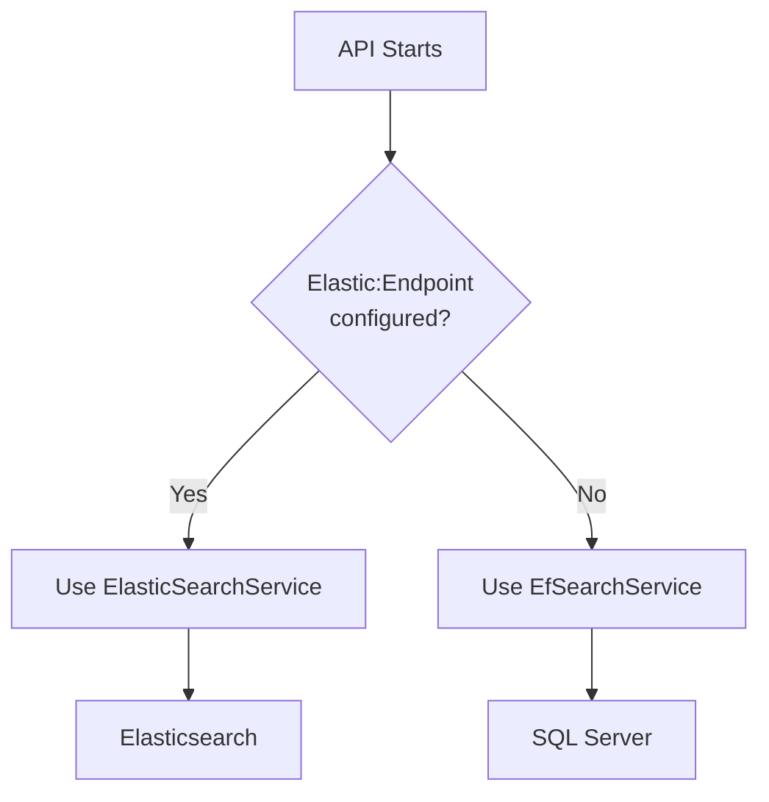

# Quick Start: Elasticsearch for CloudGames.Games

## 🚀 Get Started in 3 Steps

### 1. Start Elasticsearch (Local Development Only)

```powershell
.\start-elasticsearch.ps1
```

Wait for the message confirming services are ready.

### 2. Run the API

```powershell
cd CloudGames.Games.Api
dotnet run
```

The API will automatically detect Elasticsearch is configured and use it for search.

### 3. Test the Search

```powershell
# Using PowerShell
Invoke-WebRequest -Uri "https://localhost:7XXX/api/games/search?query=zelda" | Select-Object -Expand Content

# Or using curl
curl "https://localhost:7XXX/api/games/search?query=zelda"
```

## 🔄 Switching Between Search Implementations

### Use Elasticsearch (Local Dev)
✅ Already configured in `appsettings.Development.json`
```json
"Elastic": {
  "Endpoint": "http://localhost:9200",
  "IndexName": "games"
}
```

### Use SQL Server / EF Core (Production)
✅ Already configured in `appsettings.json` (no Elastic section)

The API automatically selects the right implementation!

## 🛑 Stop Elasticsearch

```powershell
.\stop-elasticsearch.ps1
```

## 📊 Access Kibana (Optional)

Open in browser: http://localhost:5601

Use Kibana to:
- View indexed games
- Test search queries
- Monitor performance

## ⚙️ What Was Implemented

| Component | Description | Location |
|-----------|-------------|----------|
| **docker-compose.yml** | Elasticsearch + Kibana setup | Root directory |
| **ElasticSearchService** | NEST client implementation | Infrastructure/Services |
| **EfSearchService** | SQL Server search (renamed from SearchService) | Infrastructure/Services |
| **Conditional Registration** | Auto-selects search implementation | Api/Program.cs |
| **Dev Config** | Elasticsearch endpoint for local dev | Api/appsettings.Development.json |
| **Prod Config** | No Elasticsearch (uses SQL) | Api/appsettings.json |

## 🎯 Key Features

### ElasticSearchService (Local Dev)
- ✅ Fuzzy matching (typo tolerance)
- ✅ Relevance scoring
- ✅ Multi-field search (Title, Description, Genre, Publisher)
- ✅ Field boosting (Title has 2x weight)
- ✅ Automatic index creation with mappings
- ✅ Fast full-text search

### EfSearchService (Production)
- ✅ No additional infrastructure needed
- ✅ Works with existing SQL Server
- ✅ Simple LIKE-based search
- ✅ Same API interface

## 🔍 How It Works



## 📝 Notes

- **Local Development**: Elasticsearch runs in Docker (requires Docker Desktop)
- **Azure/Production**: Uses SQL Server only (no Docker required)
- **Same Code**: Controllers use `ISearchService` - no code changes needed
- **Automatic**: Selection happens at startup based on configuration

## 🐛 Troubleshooting

### "Connection refused" error
→ Make sure Elasticsearch is running: `.\start-elasticsearch.ps1`

### API uses wrong search service
→ Check which `appsettings.*.json` is being loaded based on `ASPNETCORE_ENVIRONMENT`

### Elasticsearch not starting
→ Ensure Docker Desktop is running
→ Check ports 9200, 9300, 5601 are available

For detailed documentation, see [README.Elasticsearch.md](README.Elasticsearch.md)

